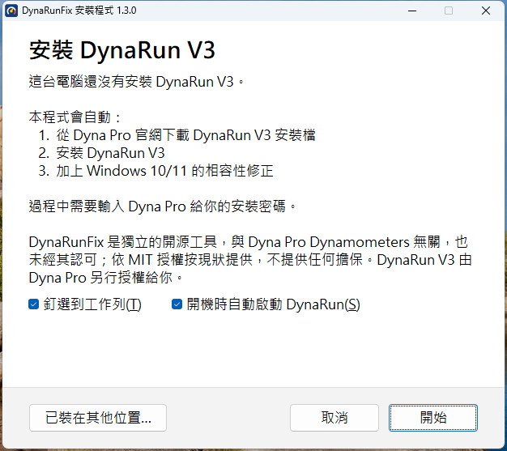
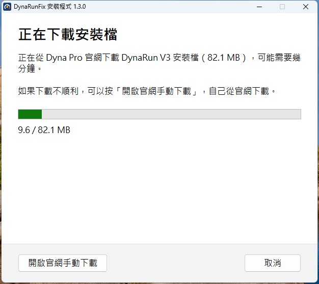
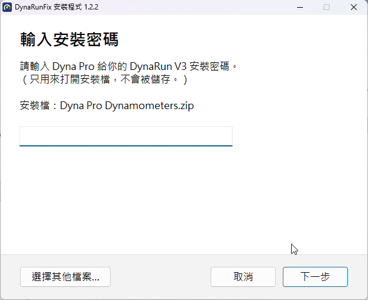
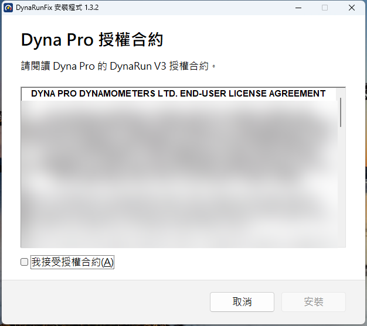
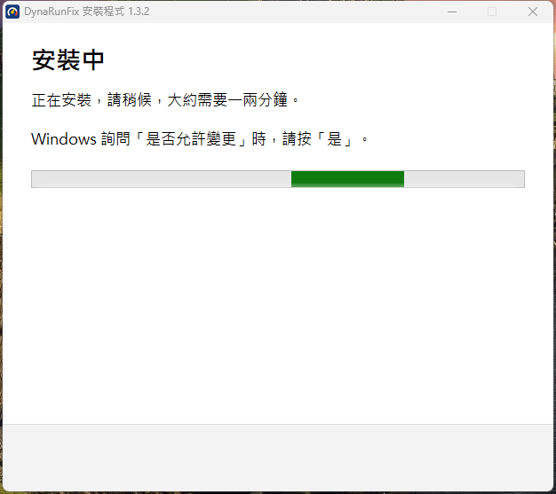
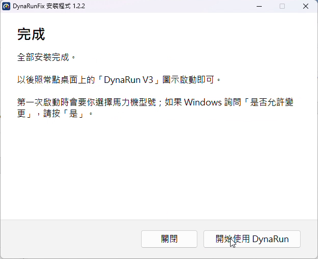
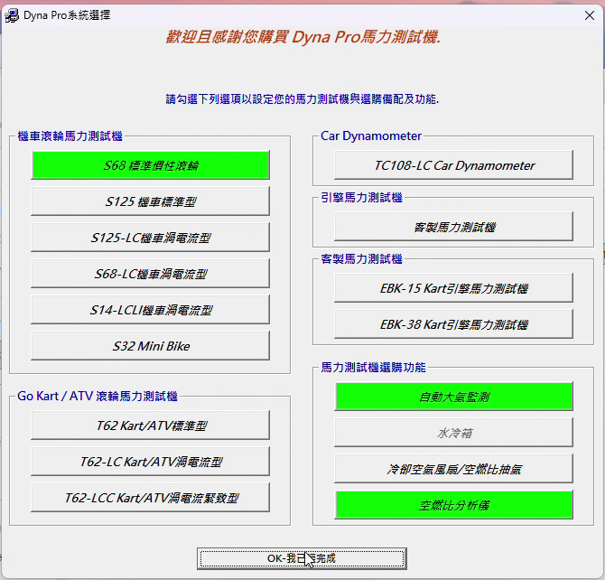
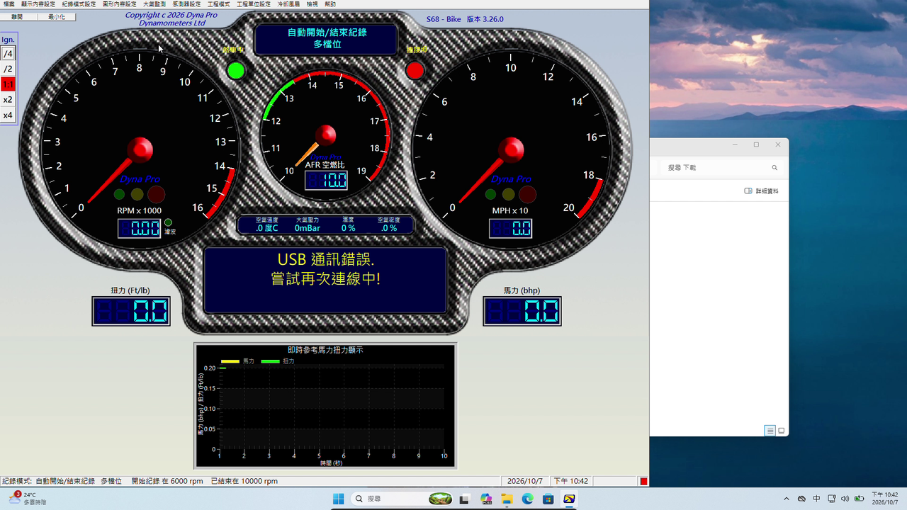

# DynaRunFix

[](https://github.com/timliudev/DynaRunFix/actions/workflows/build.yml)

A small compatibility shim that stops the **main-screen flicker** of the *DynaRun V3* dynamometer
software (Dyna Pro Dynamometers, S68 and similar rigs) when it runs **natively on Windows 10 / 11**.

[繁體中文說明在下方](#繁體中文)

> This project is not affiliated with or endorsed by Dyna Pro Dynamometers Ltd or THB Componentware.
> It does not contain, modify or redistribute any of their files, and it does not touch licensing or
> copy-protection in any way. You need your own legally installed copy of DynaRun V3, and it is up to you to
> make sure that using this fix is consistent with your licence agreement with Dyna Pro. DynaRun V3 is licensed
> to you by Dyna Pro under their own terms; the MIT licence of this project covers only DynaRunFix.

## Symptom

On Windows 10/11 the DynaRun V3 main dashboard flashes continuously (the whole window disappears and
reappears several times per second). The same installation is stable on Windows XP and Windows 7.
DPI settings, compatibility modes and whether the USB dyno is connected make no difference.

## Root cause (short version)

DynaRun V3 is a Visual Basic 6 application that uses the third-party *THBResize 2.5* control
(`THBRes25.dll`) to scale its forms.

1. THBResize reacts to every `WM_SIZE` on a form by posting itself a private message (`0x591`).
2. DynaRun's handler for that message hides the main form, loads a blank form, shows the main form
   maximized again and unloads the blank form.
3. **Windows 7/XP** do not send `WM_SIZE` when a hidden, already-maximized window is shown again with an
   unchanged size, so the sequence runs once and stops.
4. **Windows 10/11** send `WM_SIZE (SIZE_MAXIMIZED)` again in that situation (same size, the window-position
   change carries the "state changed" flag), so THBResize posts `0x591` again → endless hide/show loop.

Full analysis, message traces and the tools used: [docs/ROOT_CAUSE.md](docs/ROOT_CAUSE.md).

## The fix

`dynafix.dll` is loaded into the running DynaRun process by the `DynaRunFix.exe` launcher. Inside that
process only, it redirects THBRes25.dll's import of `PostMessageA` and drops the `0x591` message when it
was triggered by a `WM_SIZE` that is identical to the previous one for the same form. That restores the
Windows 7 behaviour; genuine size changes still go through. No file is changed; the dll only writes a
small log, `%TEMP%\dynafix.log` (every line starts with the date and time; the file is kept below 10 MB, the oldest lines are dropped first; and, on the very first start, DynaRun's own language and feature settings,
see below). The same dll also fixes the [first-time setup](#first-time-setup) and
[OneDrive files that will not open](#some-dpr-files-will-not-open-empty-file-run-properties-no-curves).

## What's new

v1.3.0:
- The installer can pin DynaRun to the taskbar and start it at sign-in (both on by default).
- Updates: once a day DynaRunFix looks for a newer release and installs it on one click.
- The first start right after installing shows the main screen correctly (before, it could be laid out too big
  until DynaRun was started again).
- Every log line has the date and time.
- Known issue: after changing the screen resolution with DynaRun open, restart DynaRun.

v1.2.3:
- Nothing that changes Dyna Pro's setup is shipped any more (`tools/msi-novbs` removed).
- The installer and the zip include miniz's licence (`LICENSE-miniz.txt`).

v1.2.2:
- First start keeps the chosen language and optional features.
- DynaRun's text in Windows' own UI font; Chinese everywhere on Windows installed in English with a Chinese locale.
- The taskbar no longer hides DynaRun's status bar.
- Installer: closes a running DynaRun for you, stays in front, works from a network drive, has an icon.

All versions: [CHANGELOG.md](CHANGELOG.md).

## Usage

1. Download **`DynaRunFix-Setup.exe`** from [Releases](https://github.com/timliudev/DynaRunFix/releases)
   and double-click it. Windows SmartScreen may say *"Windows protected your PC"* because the file is not
   code-signed: click **More info → Run anyway**.
2. Follow the window. If DynaRun V3 is not installed yet, it downloads the DynaRun V3 setup from
   [Dyna Pro's website](https://dynapro.co.uk/Software_Release.htm) (or uses a
   DynaRun setup zip or `Setup.msi` already in *Downloads*, on the desktop, in *Documents* or next to the
   installer), asks for the **setup password you got
   from Dyna Pro**, shows Dyna Pro's license and installs DynaRun V3 and the fix only after you accept it (if the
   license cannot be read from the setup, you must confirm that you accept Dyna Pro's license terms instead).
   If DynaRun V3 is already installed, it only installs the fix. Windows asks once for permission: click **Yes**.
3. Start DynaRun with its usual **DynaRun V3** icon. On the very first start (system selection) Windows asks
   once more for permission for Dyna Pro's configuration helper: click **Yes**; DynaRun then restarts by itself.

| | | |
|---|---|---|
|  |  |  |
|  |  |  |

*Fresh Windows 11 (Traditional Chinese), DynaRunFix 1.2.2.*

Nothing of Dyna Pro's is included in DynaRunFix: the setup comes from Dyna Pro's site and the password from
Dyna Pro. The DynaRun setup runs with basic UI (`msiexec /qb!`), so its wizard pages, the only part of it
that uses VBScript, are not shown. The password is used only to open the zip and is not stored.
The setup is recognised by its content, not its file name: only an MSI whose UpgradeCode is DynaRun's
(`{4787E5B2-F7CE-45B9-8D1D-68E167D06DF7}`, the same in every version) is ever installed; for the zip this is
checked after the password has opened it. Any other file is refused with a clear message.

What the installer does for the fix:
- installs `DynaRunFix.exe`, `dynafix.dll`, `LICENSE.txt`, `LICENSE-miniz.txt` and a copy of `DynaRunFix-Setup.exe` (the
  uninstaller) to `Program Files\DynaRunFix` (`Program Files (x86)\DynaRunFix` on 64-bit Windows);
- points the existing DynaRun V3 shortcuts (desktop, Start menu, pinned taskbar, all users and current
  user) to the launcher, keeping their name, icon and *Run as administrator* setting; creates a desktop
  shortcut if there is none;
- makes DynaRun's ActiveX controls visible to elevated processes (what `tools/register-machine-wide.ps1`
  does, see [below](#run-as-administrator-stops-at-system-initializing-please-wait-115));
- only if Windows' *UTF-8 for worldwide language support* option is on: adds the
  [code-page manifest](#garbled-chinese-or-other-dbcs-text-with-windows-utf-8-option) next to `DynaRun V3.exe`;
- puts [Locale Emulator](#garbled-chinese-or-other-dbcs-text-with-windows-utf-8-option) in `DynaRunFix\le`
  (used only on a Traditional Chinese system with the UTF-8 option on, or whose FontAssoc lacks `ANSI(00)=YES`);
- registers an uninstaller in *Programs and Features* / *Installed apps*.

Uninstalling restores the original shortcut files and removes the manifest it added; other accounts'
shortcuts that still start the fix are pointed back at `DynaRun V3.exe`. It asks whether to remove the fix only or
DynaRun V3 too (*Remove all* then runs Dyna Pro's own uninstaller of DynaRun V3). The machine-wide
ActiveX registrations are kept (removing them would break elevated DynaRun again). DynaRun's own files
and your data files are never changed. Windows XP, 7, 10 and 11 are supported; options: `/quiet`,
`/uninstall`, `/notaskbar`, `/noautostart`, `/keep`. `/quiet` installs only the fix and needs DynaRun V3 installed (exit
code 1 if it is not found).

Two options on the first page of the wizard, both on by default (`/quiet` applies both unless switched off with
`/notaskbar` / `/noautostart`):
- **Pin DynaRun to the taskbar.** Windows 7 to 10 pin the launcher shortcut directly; Windows XP / Vista add it to
  Quick Launch. Windows 11 lets no program pin itself, so the installer uses Microsoft's
  [taskbar layout policy](https://learn.microsoft.com/windows/configuration/taskbar/pinned-apps) for the user
  (`TaskbarLayout.xml` in the install folder; `StartLayoutFile` / `LockedStartLayout` under
  `HKEY_USERS\<user>\Software\Policies\Microsoft\Windows\Explorer`, set by the administrator step): the icon
  appears after the next sign-out / sign-in. If an organization has already set a layout file it is left alone,
  and the last page tells how to pin by hand (right-click the desktop icon → *Show more options* → *Pin to taskbar*).
  A running DynaRun groups under the pinned icon (the launcher shortcuts and DynaRun share an AppUserModelID).
- **Start DynaRun when Windows starts:** the value `DynaRunFix` under `HKCU\Software\Microsoft\Windows\CurrentVersion\Run`
  starts the launcher (`DynaRunFix.exe /autostart`) at sign-in. Installing again with the box cleared removes it; uninstall removes it for every account
  (and the policy values, and the pins of the launcher, which point back at `DynaRun V3.exe`).

**Updates.** Once a day, when DynaRun is started, the installed setup asks GitHub's API for the latest release
of this repository (nothing else is sent; the launcher waits up to 5 s). When a newer one exists, it asks
*Update now?* before DynaRun opens (after a slower answer: at the next start);
*Yes* downloads that release's `DynaRunFix-Setup.exe` (only from `github.com/timliudev/DynaRunFix`), checks its
SHA-256 against the one GitHub lists, installs it with `/quiet /keep` (one administrator prompt; `/keep` leaves the
pin, the start at sign-in and the desktop shortcut as they are) and opens DynaRun. *No* asks again the next day.
Without internet, or on Windows XP (no TLS 1.2), nothing happens.

DynaRun must be closed while the fix is installed or updated: a running DynaRun keeps the old
`dynafix.dll` (and Locale Emulator's dlls) loaded. The installer checks for a running `DynaRun V3.exe`
(and for `DynaRunFix.exe` / `LEProc.exe` from its own folder) before it changes anything. The wizard
then offers *Close DynaRun and install*: DynaRun is closed like with its own close button, and ended
if it is still running 10 seconds later (a test run in progress stops, unsaved data is lost).
`/quiet` changes nothing and ends with exit code **6**; `/quiet /close` closes DynaRun the same way first.
After copying, each installed file is read back and compared with the installer's copy.

If *Documents* is in OneDrive and an earlier copy of DynaRun's manuals or example files there is
"online-only", the installer reads those files first so that OneDrive downloads them; Windows Installer
cannot do that itself and would stop with error 1305. File contents and OneDrive settings are not changed.

The launcher elevates itself when DynaRun has to run elevated (compatibility setting *Run as
administrator*, or an elevated DynaRun is already running), so the shortcut does not need to.

### Manual use (zip)

The zip on the Releases page contains the same files (plus `le\`, the manifest, `LICENSE-miniz.txt` and
`tools\` with `register-machine-wide.ps1` and msgspy) for manual use: keep `DynaRunFix.exe` and
`dynafix.dll` **in the same folder** and start DynaRun through `DynaRunFix.exe`
(`DynaRunFix.exe "D:\path\to\DynaRun V3.exe"` for another location). If DynaRun is already running, the
launcher attaches the fix to it.

Check `%TEMP%\dynafix.log`: it should contain `patched THBRes25.dll import of PostMessageA`.

## First-time setup

On its first start DynaRun asks for the language, then for the dyno model and optional features
("Dyna Pro系統選擇"). After **OK** Windows asks once for permission for `Setup_<nnn>.exe`, Dyna Pro's per-model
configuration helper: click **Yes**. DynaRun then restarts by itself with the chosen model, language and optional
features (climate monitor, water cooler, cooling fans, AFR analyser).

Without the fix DynaRun 3.26.0 hangs at this point on every Windows version, XP included: the selection
window stays and one CPU core runs at 100 %, because DynaRun waits in an endless loop after starting the helper.
After a forced restart the language is English (the helper overwrites it) and the optional features are off
(the helper writes their enable flags as `0`). `dynafix.dll` wraps DynaRun's `ShellExecuteA` call in memory:
it waits for the helper, puts the chosen language back, switches on the picked features with the same values
*Engineering mode → System configuration → Save and exit* writes, and restarts DynaRun through
`DynaRunFix.exe /restart <pid>`. Each step is logged to `%TEMP%\dynafix.log` (every line starts with the date and time, the file is kept below 10 MB, the oldest lines are dropped first).

| Language | System selection (climate monitor and AFR analyser picked) | After the automatic restart |
|---|---|---|
|  |  |  |

Root causes, registry values, screenshots and test status: [docs/FIRST_START.md](docs/FIRST_START.md).

## Other Windows 10/11 problems

### "Run as administrator" stops at "System Initializing. Please Wait. 115"

DynaRun's setup registers several ActiveX controls (MSComm, MSCOMCTL, MSHFlexGrid, ...) only for the
current user (`HKCU\Software\Classes`) when it runs without elevation. Elevated processes ignore per-user
COM registrations, so MSComm cannot be created and initialisation stops silently at step 115. The
settings/initialisation screens need administrator rights, so this matters. The same pattern hits many
XP-era ActiveX programs; see the playbook [docs/ELEVATED_COM.md](docs/ELEVATED_COM.md).

`DynaRunFix-Setup.exe` does this automatically. Manual fix, from an **elevated** PowerShell:

```
powershell -ExecutionPolicy Bypass -File tools\register-machine-wide.ps1          # add -WhatIf to preview
```

It copies the affected CLSID/ProgID/TypeLib keys to `HKLM` (with a backup and a log, written to the current
folder unless `-BackupDir` is given). `regsvr32` alone is not enough: while a class key exists
under HKCU, writes through HKCR land in HKCU again.

To get both the flicker fix and administrator rights, start `DynaRunFix.exe` as administrator (the
installed shortcut: right-click → *Run as administrator*).

### Garbled Chinese text with a Traditional Chinese system locale

When Windows was installed in English and the system locale changed to Chinese (Taiwan) later, the
`HKLM\SYSTEM\CurrentControlSet\Control\FontAssoc\Associated Charset` key may lack `ANSI(00)=YES`. GDI
then draws DynaRun's Big5 labels in ANSI-charset fonts with code page 1252, which shows Latin letters
(`Aw³ï¥B·P...`). For a Traditional Chinese locale the launcher detects this and starts DynaRun through
[Locale Emulator](#garbled-chinese-or-other-dbcs-text-with-windows-utf-8-option) (with `dynafix.dll` attached as usual):
LE gives DynaRun the Big5 code page and charset in every window, including tooltips and OCX controls.
For other DBCS locales (and if LE is missing) `dynafix.dll` creates DynaRun's ANSI-charset fonts with the
locale's charset instead (`DYNAFIX_CHARSET`). Nothing in the registry is changed.
If the system locale is not Chinese at all, DynaRun's Chinese cannot be shown: set *Language for non-Unicode
programs* to Chinese (Traditional, Taiwan); the Chinese installer says so on its last page when it detects it.

### Garbled Chinese (or other DBCS) text with Windows' UTF-8 option

With *Region → Administrative → Change system locale → "Beta: Use Unicode UTF-8 for worldwide language
support"* enabled, the system ANSI code page is 65001 and VB6 programs show garbled DBCS text.

Copy [`manifest/DynaRun V3.exe.manifest`](manifest/DynaRun%20V3.exe.manifest) next to `DynaRun V3.exe`
(administrator rights needed in Program Files). It sets `activeCodePage=Legacy`, so DynaRun uses the system
locale's legacy code page (950 for zh-TW) while the rest of the system stays UTF-8. Windows caches the
"no manifest" result per executable, so after copying the file update the exe's modification time once
(elevated PowerShell):

```
(Get-Item 'C:\Program Files (x86)\Dyna Pro Dynamometers\DynaRun V3.exe').LastWriteTime = Get-Date
```

`%TEMP%\dynafix.log` then shows `ansi-codepage=950`. This fixes text converted inside the process (menus,
text boxes, message boxes, charts). Labels, graphic buttons and some captions are drawn through Windows
with the system code page and stay garbled; for those, DynaRunFix runs DynaRun through
[Locale Emulator](https://github.com/xupefei/Locale-Emulator) (LGPL-3.0):

- Put LE in a `le` folder next to `DynaRunFix.exe` (`DynaRunFix-Setup.exe` and the release zip already do; to fetch it yourself run
  `tools\fetch-le.ps1 -OutDir <folder>\le`). It is not installed: no context menu, nothing in the GAC.
  `le\LEConfig.xml` holds DynaRunFix's zh-TW profile.
- When the system code page is UTF-8, the system locale is Traditional Chinese (legacy code page 950) and
  `le\LEProc.exe` exists, `DynaRunFix.exe` starts DynaRun through LE and attaches the flicker fix right
  away. It does the same for a Traditional Chinese locale whose FontAssoc lacks `ANSI(00)=YES`
  ([above](#garbled-chinese-text-with-a-traditional-chinese-system-locale)). Otherwise it starts DynaRun
  directly, as before.
- Keep the manifest as well: only the combination shows all text correctly (manifest alone: labels
  garbled; LE alone: menus and message boxes garbled).
- Under LE fonts are created with the Big5 charset, so Windows would draw Arial and similar faces with
  MingLiU; `dynafix.dll` draws them in Microsoft JhengHei UI instead (see [Fonts](#fonts-windows-ui-font-everywhere)).

Verified on Windows 11 (UTF-8 option on) with DynaRun 3.26.0: menus, dialogs, labels, buttons, the
viewer and files in folders with Chinese names all work. Switching the UTF-8 option off also fixes
everything without LE. On systems without the UTF-8 option none of this is needed. `DynaRunFix-Setup.exe` adds the manifest
(and removes it on uninstall) only when the option is on.

### Fonts: Windows' UI font everywhere

DynaRun's forms ask for Arial, MS Sans Serif, Times New Roman or MingLiU (新細明體), and Windows substitutes
others for some of them, so one window mixed several faces. `dynafix.dll` now draws DynaRun's text in the
face Windows itself uses for dialogs in that language, picked by the code page DynaRun runs with (under Locale
Emulator that is Big5):

| Code page | Face (first one installed) |
|---|---|
| 950 Traditional Chinese | Microsoft JhengHei UI, Microsoft JhengHei |
| 936 Simplified Chinese | Microsoft YaHei UI, Microsoft YaHei |
| 932 Japanese | Yu Gothic UI, Meiryo UI |
| 949 Korean | Malgun Gothic |
| other (English, ...) | the system's message font: Segoe UI (Tahoma on XP) |

- Applies on every path: native Traditional Chinese Windows, a locale changed later (Locale Emulator or
  `DYNAFIX_CHARSET`), English Windows.
- Swapped faces: Arial, Times New Roman, MS Sans Serif, Microsoft Sans Serif, MS Shell Dlg, Tahoma, Verdana,
  Segoe UI, MingLiU / PMingLiU / 新細明體 and the other languages' old UI faces (SimSun, MS UI Gothic, Gulim, ...).
  Symbol, digital and fixed-pitch faces (Wingdings, 7-segment fonts, Courier New, ...) and narrow or heavy faces
  (Arial Narrow, Arial Black) stay as they are.
- Covers DynaRun itself, its OCX controls (toolbars, lists, grids, tabs, the chart), VB's fonts, THBResize and
  the common controls (tooltips), including the stock GUI font. Menus, message boxes and the file dialogs are
  drawn by Windows and already use the UI font.
- The UI faces have a taller line than the old ones, so text of 16 px and up is scaled to 90 % to keep
  multi-line labels fitting (`DYNAFIX_FONT_SCALE`, 50-150). VB is also told the line height of Arial
  (1.12 em) for the UI face, so lines of multi-line labels stay as close together as before; the text keeps
  its size (`DYNAFIX_FONT_LINEH`, in 1/1000 em, `0` = off).
- `DYNAFIX_FONT=<face>` picks another face, `DYNAFIX_FONT=off` (or `none`, `0`) keeps DynaRun's own fonts. Only DynaRun's
  process is affected; no file or setting is changed.

Status: verified on Windows 11 with DynaRun 3.26.0 (native Traditional Chinese, and English Windows with the
locale changed to Traditional Chinese through Locale Emulator).

### Status bar hidden behind the taskbar

DynaRun's main window is maximized but has no title bar. Windows maximizes such a window over the whole
monitor, so a taskbar at the bottom covers DynaRun's status bar (recording mode, date, time). This is DynaRun's
own behaviour on every Windows version, XP included; with the taskbar on the side the status bar is visible.

`dynafix.dll` makes DynaRun see the primary monitor's work area (the screen minus the taskbar) as its screen
size: VB's cached screen size (`Screen.Width/Height`) is changed in memory before DynaRun's first form loads.
DynaRun sizes its main window and its whole dashboard layout from that value, so everything is laid out as on a
slightly smaller monitor, with nothing out of place. VB copies the value when the first form loads, so the
launcher attaches the fix right as DynaRun starts (through Locale Emulator, LEProc runs in a job object that
reports DynaRun's start at once). As a fallback the maximized window is kept inside the work area. With an
auto-hide taskbar 2 pixels are left free on that edge. `DYNAFIX_FULLSCREEN=1` keeps the original full-screen
window; `DYNAFIX_WORKAREA=clip` only keeps the window inside the work area without changing VB's screen size. The log shows `VB's screen size 2048x1280 -> 2048x1232 (work area)` when it applies.

| Before: the taskbar covers the status bar | After: status bar above the taskbar |
|---|---|
|  |  |

*Windows 11, 2560x1600 at 125 %.*

Status: verified on Windows 11 (1920x1080, taskbar at the bottom) and on a Windows 11 PC at 2560x1600 / 125 %,
both through Locale Emulator. Windows XP and auto-hide / multi-monitor setups not tested yet.

### DynaRun's screen looks wrong

If DynaRun's screen ever looks wrong (for example after it started by itself at sign-in, while Windows was still
setting up the desktop), close DynaRun and start it again. The start at sign-in waits until the taskbar is there and
the screen size has not changed for 3 seconds (at most 60 s; `launcher: autostart waited ...` in `%TEMP%\dynafix.log`).

### Some .Dpr files will not open (empty File Run Properties, no curves)

Files stored in OneDrive and marked *Always keep on this device* carry the attribute `0x80000`
(`FILE_ATTRIBUTE_PINNED`), which does not exist on Windows 7/XP. DynaRun checks the selected file with VB's
`GetAttr`, does not recognise the value as a normal file and silently gives up; Process Monitor shows it
querying the attributes but never opening the file for reading. The file's contents (e.g. the `#2025-05-01#`
date written by older versions) are not the cause: a byte-identical copy without the attribute opens fine.

`dynafix.dll` fixes this in memory: the file-attribute APIs imported by `MSVBVM60.DLL` and `scrrun.dll`
return the attributes without the cloud bits (pinned, unpinned, recall-on-open, recall-on-data-access).
Files and OneDrive settings are not changed. The log shows `cleared cloud attributes 00080020 in
GetFileAttributesA` when it applies. Verified on Windows 11 with DynaRun 3.26.0.

### Setup warns "This setup uses VBScript custom actions" (Windows 11 25H2)

Only the setup wizard's **Next**/**Back** buttons use VBScript (two Wise custom actions); DynaRun itself and
everything the setup installs do not. Once Windows disables VBScript by default (planned for about 2027) the
interactive setup is expected to stop at the first **Next**, while `msiexec /i Setup.msi /qb` keeps working.
`DynaRunFix-Setup.exe` already runs it that way, so this only matters when you start Dyna Pro's `Setup.msi` yourself.
If VBScript has been switched off, turn it back on under *Optional features* before running that setup, or ask
Dyna Pro for a setup that does not need it. Details and timeline: [docs/VBSCRIPT.md](docs/VBSCRIPT.md).

## Building

Requires Visual Studio 2019 or newer with the C++ desktop workload. Run:

```
build.cmd
```

Output goes to `build\`: `DynaRunFix.exe`, `dynafix.dll`, `msgspy.exe` / `msgspy.dll` and
`DynaRunFix-Setup.exe`, which embeds the launcher, the dll, the manifest, Locale Emulator and miniz's licence
(set `DRF_VERSION` for its version string). The first build downloads Locale Emulator into `build\le` through
`tools\fetch-le.ps1` (PowerShell, internet access, SHA-256 checked). The installer uses
[miniz](https://github.com/richgel999/miniz) 3.1.2 (MIT, `third_party/miniz`) to unpack the DynaRun setup. The binaries are 32-bit, have no C runtime dependency and target Windows XP and later.

## Diagnostic tool: msgspy

`tools/msgspy` is the window-message logger used to find the cause. With DynaRun already running and
`msgspy.dll` next to `msgspy.exe`, it hooks DynaRun's GUI thread and
writes every relevant message (with decoded `WM_SIZE`, `WM_WINDOWPOSCHANGING/CHANGED`, `WM_GETMINMAXINFO`,
`WM_CREATE`, `WM_SETTEXT`) to `msgspy_<COMPUTERNAME>.log` next to the executable. It runs unchanged on
XP, 7 and 11, which makes side-by-side comparison with a VM easy.

```
msgspy.exe [seconds] [message-to-post-hex]    # seconds: default 10
msgspy.exe 3          # log 3 seconds
msgspy.exe 4 591      # log 4 seconds and post 0x591 once to the maximized form
```

## License

MIT, see [LICENSE](LICENSE).

---

## 繁體中文

讓 *DynaRun V3* 馬力機軟體(Dyna Pro Dynamometers,S68 等機型)**原生在 Windows 10/11 執行時主畫面不再閃爍**的小型相容性修正。

> 本專案與 Dyna Pro Dynamometers Ltd、THB Componentware 無任何關係,不包含、不修改、不散布原廠任何檔案,
> 也完全不碰授權或防拷機制。你必須自備合法安裝的 DynaRun V3,並請自行確認使用本修正符合你與 Dyna Pro 之間的授權條款。
> DynaRun V3 由 Dyna Pro 依其條款另行授權給你;本專案的 MIT 授權只涵蓋 DynaRunFix 本身。

### 症狀
Win10/11 上主儀表板每秒閃好幾次(整個視窗消失又出現);同一套安裝在 XP / Win7 正常。
改 DPI、相容模式、有無接 USB 馬力機都沒差。

### 原因
1. DynaRun 用第三方 VB6 元件 THBResize 2.5(`THBRes25.dll`)做表單縮放,它每收到一次 `WM_SIZE` 就 post 一個私有訊息 `0x591`。
2. DynaRun 處理 `0x591` 時會:隱藏主表單 → 載入空白表單 → 主表單最大化顯示 → 卸載空白表單。
3. Win7/XP 重新顯示「已最大化、尺寸沒變」的視窗時**不送** `WM_SIZE`,跑一輪就停。
4. Win10/11 在同樣情況**照送** `WM_SIZE`,於是又觸發 `0x591` → 無限迴圈 → 閃爍。

詳細分析與訊息追蹤紀錄見 [docs/ROOT_CAUSE.md](docs/ROOT_CAUSE.md)。

### 修正方式
啟動器 `DynaRunFix.exe` 把 `dynafix.dll` 載入 DynaRun 行程,只在記憶體中把 THBRes25 對 `PostMessageA` 的呼叫導向修正函式:
若這次 `0x591` 是由「與上一次完全相同的 `WM_SIZE`」引起的就不送出,行為就跟 Win7 一樣。真正的尺寸變化照常處理。
不修改任何檔案,只寫一個 log:`%TEMP%\dynafix.log`(每行開頭有日期與時間,保持在 10 MB 以下,最舊的行先被丟掉;第一次啟動時另外會寫 DynaRun 自己的語言和選購功能設定,見下方)。同一個 dll 也修正[首次設定](#首次設定)與 [OneDrive 檔案打不開](#部分-dpr-打不開file-run-properties-全空沒有曲線)的問題。

### 更新內容
v1.3.0:
- 安裝程式可以把 DynaRun 釘選到工作列、開機自動啟動(兩項預設勾選)。
- 自動更新:每天檢查一次有沒有新版,按一下就安裝。
- 裝好後第一次開 DynaRun,主畫面就正常(以前可能排得太大,要再開一次才正常)。
- log 每行都有日期時間。
- 已知問題:DynaRun 開著時改了螢幕解析度,請重開 DynaRun。

v1.2.3:
- 不再提供任何會修改 Dyna Pro 安裝檔的工具(移除 `tools/msi-novbs`)。
- 安裝程式與 zip 附上 miniz 的授權(`LICENSE-miniz.txt`)。

v1.2.2:
- 首次啟動保留選的語言和選購功能。
- DynaRun 的文字改用 Windows 介面字型;英文安裝、地區改成中文的 Windows 也全部顯示中文。
- 工作列不再遮住 DynaRun 的狀態列。
- 安裝程式:會幫你關閉執行中的 DynaRun、保持在最前面、可從網路磁碟機執行、有圖示了。

所有版本的紀錄:[CHANGELOG.md](CHANGELOG.md#更新紀錄)。

### 使用方式
1. 從 [Releases](https://github.com/timliudev/DynaRunFix/releases) 下載 **`DynaRunFix-Setup.exe`**，雙擊執行。
   因為檔案沒有數位簽章，Windows SmartScreen 可能顯示「Windows 已保護您的電腦」：請按 **其他資訊 → 仍要執行**。
2. 照畫面操作。還沒安裝 DynaRun V3 時，會從 [Dyna Pro 官網](https://dynapro.co.uk/Software_Release.htm)下載安裝檔
   （「下載」、桌面、「文件」或安裝程式旁邊已經有 DynaRun 安裝檔 zip 或 `Setup.msi` 就直接用），請你輸入 **Dyna Pro 給的安裝密碼**，
   顯示 Dyna Pro 的授權合約，你接受後才安裝 DynaRun V3 和修正（安裝檔裡的合約讀不出來時，必須勾選同意 Dyna Pro 的授權條款才能繼續）。已經裝好 DynaRun V3 時，只會安裝修正。
   Windows 會詢問一次是否允許變更，請按 **是**。
3. 以後照常點 **DynaRun V3** 圖示啟動。第一次啟動（選擇系統）時，Windows 會再問一次是否允許 Dyna Pro 的設定程式變更，
   請按 **是**，DynaRun 會自己重新啟動。

| | | |
|---|---|---|
|  |  |  |
|  |  |  |

*全新的 Win11(繁體中文),DynaRunFix 1.2.2。*

DynaRunFix 不包含任何 Dyna Pro 的檔案：安裝檔來自 Dyna Pro 官網，密碼由 Dyna Pro 提供。DynaRun 安裝檔以基本介面
（`msiexec /qb!`）執行，所以不會出現它的精靈頁面（安裝檔裡唯一用到 VBScript 的部分）。密碼只用來打開 zip，不會被儲存。
安裝檔是依內容辨識，不看檔名：只有 UpgradeCode 是 DynaRun 的（`{4787E5B2-F7CE-45B9-8D1D-68E167D06DF7}`，每個版本都相同）
MSI 才會被安裝；zip 要等輸入密碼打開後才能檢查。其他檔案會被拒絕，並清楚告訴你原因。

安裝修正時會做這些事：
- 把 `DynaRunFix.exe`、`dynafix.dll`、`LICENSE.txt`、`LICENSE-miniz.txt` 和一份 `DynaRunFix-Setup.exe`（解除安裝用）安裝到 `Program Files\DynaRunFix`（64 位元 Windows 為 `Program Files (x86)\DynaRunFix`）；
- 把現有的 DynaRun V3 捷徑（桌面、開始功能表、釘選到工作列；所有使用者與目前使用者）改為經由啟動器執行，名稱、圖示和「以系統管理員身分執行」設定都保留；沒有桌面捷徑時會建立一個；
- 讓 DynaRun 的 ActiveX 元件在系統管理員模式下也能使用（等同 `tools/register-machine-wide.ps1`，見[下方](#以系統管理員執行卡在system-initializing-please-wait-115)）；
- 只有開啟 Windows「使用 Unicode UTF-8 提供全球語言支援」時，才在 `DynaRun V3.exe` 旁加上[字碼頁 manifest](#開啟系統-utf-8-選項時中文亂碼)；
- 把 [Locale Emulator](#開啟系統-utf-8-選項時中文亂碼) 放到 `DynaRunFix\le`（只有繁中系統開了 UTF-8 選項，或 FontAssoc 缺 `ANSI(00)=YES` 時才會用到）；
- 在「程式和功能」／「已安裝的應用程式」登錄解除安裝項目。

解除安裝會把捷徑檔還原成原本的內容，並移除它加上的 manifest；其他帳號仍指向修正版的捷徑會改回指向 `DynaRun V3.exe`。解除安裝時可選「只移除修正」或「全部移除」（接著用 Dyna Pro 自己的解除安裝程式移除 DynaRun V3）。系統層級的 ActiveX 註冊會保留（移除的話，以系統管理員執行 DynaRun 又會壞掉）。
不會修改 DynaRun 本身的檔案和你的資料檔。支援 XP、7、10、11；參數：`/quiet`、`/uninstall`、`/notaskbar`、`/noautostart`、`/keep`（`/quiet` 只安裝修正，需要已經裝好 DynaRun V3，找不到時以結束代碼 1 結束）。

精靈第一頁有兩個選項，預設都勾選（`/quiet` 也預設套用，可用 `/notaskbar`、`/noautostart` 關閉）：
- **釘選到工作列。** Windows 7 到 10 直接釘選啟動器捷徑；Windows XP / Vista 放進「快速啟動」。Windows 11 不允許程式自行釘選，
  所以安裝程式改用微軟的[工作列配置原則](https://learn.microsoft.com/windows/configuration/taskbar/pinned-apps)
  （安裝資料夾裡的 `TaskbarLayout.xml`；系統管理員那一步會在 `HKEY_USERS\<使用者>\Software\Policies\Microsoft\Windows\Explorer`
  設定 `StartLayoutFile`／`LockedStartLayout`）：登出再登入後圖示才會出現。組織已經設定配置檔時不會去動它，
  最後一頁會說明手動釘選的方式（在桌面圖示按右鍵 →「顯示其他選項」→「釘選到工作列」）。
  執行中的 DynaRun 會歸在釘選的圖示下（啟動器捷徑和 DynaRun 使用相同的 AppUserModelID）。
- **開機時自動啟動 DynaRun：** `HKCU\Software\Microsoft\Windows\CurrentVersion\Run` 的 `DynaRunFix` 值在登入時啟動啟動器（`DynaRunFix.exe /autostart`）。
  取消勾選後重新安裝會移除它；解除安裝會移除所有帳號的這個值（以及原則值；釘選的啟動器捷徑改回指向 `DynaRun V3.exe`）。

**更新。** 每天一次，開啟 DynaRun 時，安裝好的安裝程式會向 GitHub API 查詢本專案的最新版本（不會送出其他資料；啟動器最多等 5 秒）。
有新版時，在 DynaRun 開啟前問「現在更新嗎？」（回應較慢時下次開啟再問）；按「是」會下載該版本的 `DynaRunFix-Setup.exe`（只從 `github.com/timliudev/DynaRunFix`），
用 GitHub 列出的 SHA-256 核對，以 `/quiet /keep` 安裝（一次系統管理員確認；`/keep` 讓釘選、開機自動啟動和桌面捷徑維持原樣），再開啟 DynaRun。
按「否」隔天會再問。沒有網路或 Windows XP（不支援 TLS 1.2）時什麼都不做。

安裝或更新修正時，DynaRun 必須是關閉的：執行中的 DynaRun 會一直用已經載入的舊 `dynafix.dll`（和 Locale Emulator 的 dll）。
安裝程式在改動任何東西之前，會先檢查是否有執行中的 `DynaRun V3.exe`（以及從安裝資料夾執行的 `DynaRunFix.exe`／`LEProc.exe`）。
精靈會顯示「關閉 DynaRun 並安裝」：像按 DynaRun 自己的關閉鈕一樣關掉它，10 秒後還沒結束就強制結束（正在進行的測試會中斷，沒存檔的資料會遺失）。
`/quiet` 則不做任何變更，以結束代碼 **6** 結束；`/quiet /close` 會先用同樣方式關閉 DynaRun 再安裝。複製完成後，每個安裝的檔案都會讀回來和安裝程式內的版本比對。

如果「文件」放在 OneDrive，而之前留下的 DynaRun 手冊或範例檔是「只在線上」，安裝程式會先讀取這些檔案讓 OneDrive 下載下來；
Windows Installer 自己做不到，會出現錯誤 1305。不會改變檔案內容或 OneDrive 設定。

DynaRun 需要以系統管理員執行時（相容性設定勾了「以系統管理員身分執行」，或已有一個以系統管理員執行中的 DynaRun），啟動器會自己提升權限，捷徑不需要另外設定。

#### 手動使用（zip）
Releases 的 zip 內含同樣的檔案（另外還有 `le\`、manifest、`LICENSE-miniz.txt`，以及放 `register-machine-wide.ps1` 和 msgspy 的 `tools\`）：把 `DynaRunFix.exe` 和 `dynafix.dll` 放在**同一個資料夾**，從 `DynaRunFix.exe` 啟動
（裝在其他路徑：`DynaRunFix.exe "D:\路徑\DynaRun V3.exe"`）。DynaRun 若已在執行，會直接套用修正。

`%TEMP%\dynafix.log` 出現 `patched THBRes25.dll import of PostMessageA` 即代表生效。

### 首次設定
首次啟動時 DynaRun 會先問語言,再顯示「Dyna Pro系統選擇」(機型與選購功能)。按 **OK** 後 Windows 會詢問一次是否允許
`Setup_<編號>.exe`(Dyna Pro 各機型的設定程式)變更,請按 **是**。之後 DynaRun 會自動以選好的機型、語言和選購功能
(大氣監測、水冷、冷卻風扇、空燃比分析儀)重新啟動。

沒有修正時,DynaRun 3.26.0 在任何 Windows 版本(包括 XP)都會卡在這裡:選擇視窗不消失、CPU 一核 100%,因為 DynaRun 啟動設定程式後進入無限迴圈。
強制重新啟動後語言變成英文(被設定程式蓋掉),選購功能也是關閉的(設定程式把啟用旗標寫成 `0`)。
`dynafix.dll` 只在記憶體中包裝 DynaRun 的 `ShellExecuteA`:等設定程式結束、寫回選的語言、以和「工程模式 → 系統組態設定 → 存檔並離開」相同的值啟用勾選的功能,
再透過 `DynaRunFix.exe /restart <pid>` 重新啟動 DynaRun。每一步都記錄在 `%TEMP%\dynafix.log`(每行有日期與時間,保持在 10 MB 以下,最舊的行先被丟掉)。

| 語言 | 系統選擇(勾選大氣監測、空燃比分析儀) | 自動重新啟動後 |
|---|---|---|
|  |  |  |

根本原因、登錄值、截圖與測試狀態見 [docs/FIRST_START.md](docs/FIRST_START.md)。

### 以系統管理員執行卡在「System Initializing. Please Wait. 115」
原廠安裝程式以一般權限執行時,MSComm、MSCOMCTL、MSHFlexGrid 等 ActiveX 元件只註冊在目前使用者(HKCU)。
以系統管理員執行的程式會忽略 HKCU 的 COM 註冊,所以建立 MSComm 失敗,初始化就停在 115。
進入語言或初始化設定畫面都需要系統管理員權限,所以這個問題一定得處理。很多 XP 時代的 ActiveX 程式都有同樣的問題,通用的診斷與修正流程見 [docs/ELEVATED_COM.md](docs/ELEVATED_COM.md)。

`DynaRunFix-Setup.exe` 會自動處理。手動修正:以**系統管理員**開 PowerShell,執行 `tools\register-machine-wide.ps1`(加 `-WhatIf` 可以先預覽),
它會把相關的 CLSID/ProgID/TypeLib 複製到 HKLM,並留下備份和 log(預設在目前資料夾,可用 `-BackupDir` 指定)。只跑 `regsvr32` 沒用,因為機碼已經存在於 HKCU 時,寫入會落回 HKCU。
要同時有防閃爍修正和系統管理員權限,請以系統管理員身分執行 `DynaRunFix.exe`
(在安裝好的捷徑上按右鍵 →「以系統管理員身分執行」)。

### 系統地區是繁體中文仍然亂碼
Windows 以英文安裝、之後才把系統地區改成中文(台灣)時,`HKLM\SYSTEM\CurrentControlSet\Control\FontAssoc\Associated Charset`
可能沒有 `ANSI(00)=YES`。GDI 會用字碼頁 1252 繪製 ANSI 字元集字型裡的 Big5 標籤,變成 `Aw³ï¥B·P...` 這類拉丁字母。
系統地區是繁體中文時,啟動器偵測到這種情況就改用 Locale Emulator 啟動 DynaRun(照常掛上 `dynafix.dll`),
所有視窗(含工具提示和 OCX 控制項)都以 Big5 字碼頁與字元集顯示。其他 DBCS 地區(或找不到 LE 時)則由 `dynafix.dll`
只在 DynaRun 內把 ANSI 字元集字型改用該地區的字元集建立(`DYNAFIX_CHARSET`)。不改登錄。
系統地區根本不是中文時無法顯示 DynaRun 的中文,請把「非 Unicode 程式的語言」設為「中文(繁體,台灣)」;中文版安裝程式偵測到時會在最後一頁提示。

### 開啟系統 UTF-8 選項時中文亂碼
「地區 → 系統管理 → 變更系統地區設定 → Beta:使用 Unicode UTF-8 提供全球語言支援」開啟時,系統 ANSI 字碼頁是 65001,VB6 程式的中文會變亂碼。
把 [`manifest/DynaRun V3.exe.manifest`](manifest/DynaRun%20V3.exe.manifest) 複製到 `DynaRun V3.exe` 旁邊(Program Files 需要系統管理員權限),
DynaRun 就會改用系統地區的舊字碼頁(zh-TW 是 950),其他程式維持 UTF-8。Windows 會快取「這支 exe 沒有 manifest」的判斷,
複製完要用系統管理員 PowerShell 更新一次 exe 的修改時間:
`(Get-Item 'C:\Program Files (x86)\Dyna Pro Dynamometers\DynaRun V3.exe').LastWriteTime = Get-Date`。
之後 `%TEMP%\dynafix.log` 會顯示 `ansi-codepage=950`。選單、文字框、訊息框、圖表都會正常;
標籤、圖形按鈕和部分標題是經由 Windows 用系統字碼頁繪製的,仍會亂碼,這部分由 DynaRunFix 透過
[Locale Emulator](https://github.com/xupefei/Locale-Emulator)(LGPL-3.0)啟動 DynaRun 來解決:

- 把 LE 放在 `DynaRunFix.exe` 旁邊的 `le` 資料夾(`DynaRunFix-Setup.exe` 會自動安裝,release zip 也已附;要自己下載就執行 `tools\fetch-le.ps1 -OutDir <資料夾>\le`)。
  不需要安裝:不加右鍵選單、不寫入 GAC。`le\LEConfig.xml` 是 DynaRunFix 的 zh-TW 設定。
- 系統字碼頁是 UTF-8、系統地區是繁體中文(舊字碼頁 950),且有 `le\LEProc.exe` 時,`DynaRunFix.exe` 會透過 LE 啟動 DynaRun,並立刻掛上防閃爍修正;
  系統地區是繁體中文但 FontAssoc 缺 `ANSI(00)=YES` 時也一樣(見[上方](#系統地區是繁體中文仍然亂碼))。其他情況照舊直接啟動。
- manifest 也要保留:兩者一起才會全部正常(只有 manifest:標籤亂碼;只有 LE:選單和訊息框亂碼)。
- 透過 LE 時字型會以 Big5 字元集建立,Windows 會把 Arial 等字型換成細明體;`dynafix.dll` 改用 Microsoft JhengHei UI 繪製
  (見[字型](#字型全部使用-windows-介面字型))。

已在 Win11(開啟 UTF-8 選項)+ DynaRun 3.26.0 驗證:選單、對話框、標籤、按鈕、看圖程式、中文資料夾裡的檔案都正常。
關閉 UTF-8 選項也能全部正常,不需要 LE。沒開 UTF-8 選項的電腦完全不需要這一步。`DynaRunFix-Setup.exe` 只在開啟該選項時才加上 manifest(解除安裝時移除)。

### 字型:全部使用 Windows 介面字型

DynaRun 的表單指定 Arial、MS Sans Serif、Times New Roman 或新細明體,其中一部分又被 Windows 替換,同一個視窗裡混著好幾種字型。
現在 `dynafix.dll` 讓 DynaRun 的文字都用 Windows 該語言對話框所用的字型,依 DynaRun 執行時的字碼頁決定(透過 Locale Emulator 時為 Big5):

| 字碼頁 | 字型(取第一個已安裝的) |
|---|---|
| 950 繁體中文 | Microsoft JhengHei UI、Microsoft JhengHei |
| 936 簡體中文 | Microsoft YaHei UI、Microsoft YaHei |
| 932 日文 | Yu Gothic UI、Meiryo UI |
| 949 韓文 | Malgun Gothic |
| 其他(英文等) | 系統訊息字型:Segoe UI(XP 為 Tahoma) |

- 所有情況都套用:原生繁中 Windows、後來才改地區(Locale Emulator 或 `DYNAFIX_CHARSET`)、英文 Windows。
- 替換的字型:Arial、Times New Roman、MS Sans Serif、Microsoft Sans Serif、MS Shell Dlg、Tahoma、Verdana、Segoe UI、
  細明體/新細明體,以及其他語言的舊介面字型(SimSun、MS UI Gothic、Gulim 等)。符號、數位、等寬字型(Wingdings、七段顯示字型、
  Courier New 等)與窄體/粗黑字型(Arial Narrow、Arial Black)不變。
- 範圍包含 DynaRun 本身、OCX 元件(工具列、清單、表格、頁籤、圖表)、VB 字型、THBResize 與通用控制項(工具提示),也包含系統預設 GUI 字型。
  選單、訊息框和開檔對話框由 Windows 繪製,本來就是介面字型。
- 介面字型行高較高,16 px 以上的字縮為 90%,多行標籤才放得下(`DYNAFIX_FONT_SCALE`,50–150)。介面字型的行高也會以 Arial 的行高(1.12 em)回報給 VB,
  多行標籤的行距維持原本的樣子,字本身大小不變(`DYNAFIX_FONT_LINEH`,單位 1/1000 em,`0` 為關閉)。
- `DYNAFIX_FONT=<字型>` 指定其他字型,`DYNAFIX_FONT=off`(或 `none`、`0`)保留 DynaRun 原本的字型。只影響 DynaRun 的程序,不改任何檔案或設定。

狀態:已在 Win11 + DynaRun 3.26.0 驗證(原生繁中,以及英文安裝、地區改為繁中並經 Locale Emulator)。

### 狀態列被工作列遮住
DynaRun 主視窗是最大化但沒有標題列的視窗,Windows 會把這種視窗放大到整個螢幕,所以放在底部的工作列會蓋住
DynaRun 的狀態列(紀錄模式、日期、時間)。這是 DynaRun 原本的行為,XP 也一樣;工作列放在側邊時就看得到。

`dynafix.dll` 讓 DynaRun 把主螢幕的工作區(扣掉工作列的範圍)當成螢幕大小:在 DynaRun 載入第一個表單之前,
只在記憶體中把 VB 記住的螢幕大小(`Screen.Width/Height`)改成工作區大小。DynaRun 依這個值決定主視窗和整個儀表
版面,所以畫面就像在稍小的螢幕上,所有元件位置都正確。VB 在載入第一個表單時就會複製這個值,所以 launcher
在 DynaRun 一啟動就掛上修正(經過 Locale Emulator 時,LEProc 放在 job 物件中,DynaRun 一建立就會立即通知)。
另外仍保留把最大化視窗限制在工作區內的保險。工作列自動隱藏時該邊留 2 像素。`DYNAFIX_FULLSCREEN=1` 保留原本的
全螢幕視窗;`DYNAFIX_WORKAREA=clip` 只把視窗限制在工作區內,不改 VB 的螢幕大小。生效時 log 會出現 `VB's screen size 2048x1280 -> 2048x1232 (work area)`。

| 修正前:工作列蓋住狀態列 | 修正後:狀態列在工作列上方 |
|---|---|
|  |  |

*Win11,2560x1600、125%。*

狀態:已在 Win11(1920x1080、工作列在底部)及 Win11 2560x1600 / 125% 的電腦上驗證,兩者都經 Locale Emulator。XP、工作列自動隱藏、多螢幕尚未測試。

### DynaRun 的畫面顯示不正常

如果 DynaRun 的畫面顯示不正常（例如開機登入後自動啟動、Windows 還在準備桌面時就開了），關掉 DynaRun 再開一次即可。
登入時的自動啟動會等到工作列出現、且螢幕大小連續 3 秒沒變才啟動（最多等 60 秒；`%TEMP%\dynafix.log` 會有
`launcher: autostart waited ...`））。

### 部分 .Dpr 打不開(File Run Properties 全空、沒有曲線)
放在 OneDrive 且設成「永遠保留在此裝置」的檔案帶有屬性 `0x80000`(`FILE_ATTRIBUTE_PINNED`),這是 Win7/XP 沒有的屬性。
DynaRun 會用 VB 的 `GetAttr` 檢查選取的檔案,不認得這個值就當成「不是一般檔案」,而且不顯示錯誤;
Process Monitor 可以看到它只查了屬性,完全沒開檔讀取。跟檔案內容無關(例如舊版寫入的 `#2025-05-01#` 日期):
內容完全相同、只是沒有這個屬性的副本就能正常開啟。

`dynafix.dll` 只在記憶體中處理:`MSVBVM60.DLL` 和 `scrrun.dll` 匯入的檔案屬性 API 回傳時,會去掉雲端相關位元
(pinned、unpinned、recall-on-open、recall-on-data-access)。不修改任何檔案,也不改 OneDrive 設定。
生效時 log 會出現 `cleared cloud attributes 00080020 in GetFileAttributesA`。已在 Win11 + DynaRun 3.26.0 驗證。

### 安裝程式出現「此安裝程式使用 VBScript 自訂動作」警告(Win11 25H2)
只有安裝精靈的「Next/Back」換頁用到 VBScript(Wise 的兩個自訂動作),DynaRun 本身和安裝的內容都沒有。
微軟預計約 2027 年預設停用 VBScript,屆時直接點兩下安裝,預期會在第一次按 Next 就失敗;`msiexec /i Setup.msi /qb`(不顯示精靈)仍可安裝。
`DynaRunFix-Setup.exe` 本來就是這樣執行它,只有自己直接執行 Dyna Pro 的 `Setup.msi` 時才會遇到。
若 VBScript 已被停用,請先到「選用功能」重新啟用再執行該安裝程式,或向 Dyna Pro 索取不需要 VBScript 的安裝檔。時程與細節見 [docs/VBSCRIPT.md](docs/VBSCRIPT.md)。

### 建置
安裝 Visual Studio 2019 以上(含 C++ 桌面開發),執行 `build.cmd`,產物在 `build\`:`DynaRunFix.exe`、`dynafix.dll`、`msgspy.exe`/`msgspy.dll` 和 `DynaRunFix-Setup.exe`(內含啟動器、dll、manifest、Locale Emulator 和 miniz 授權;版本字串用環境變數 `DRF_VERSION` 指定)。第一次建置會透過 `tools\fetch-le.ps1` 把 Locale Emulator 下載到 `build\le`(需要 PowerShell 與網路,會檢查 SHA-256)。安裝程式用 [miniz](https://github.com/richgel999/miniz) 3.1.2(MIT 授權,在 `third_party/miniz`)解開 DynaRun 安裝檔。32 位元、不依賴 C 執行階段、XP 以上皆可執行。

### 診斷工具:msgspy
`tools/msgspy` 是找出原因時用的視窗訊息記錄工具。DynaRun 要先在執行中、`msgspy.dll` 要和 `msgspy.exe` 放在一起;它掛到 DynaRun 的 GUI 執行緒,把相關訊息(含解碼後的 `WM_SIZE`、`WM_WINDOWPOSCHANGING/CHANGED`、`WM_GETMINMAXINFO`、`WM_CREATE`、`WM_SETTEXT`)寫到執行檔旁的 `msgspy_<電腦名稱>.log`。XP、7、11 都能直接執行,方便和 VM 對照。

```
msgspy.exe [秒數] [要送出的訊息(16 進位)]    # 秒數預設 10
msgspy.exe 3          # 記錄 3 秒
msgspy.exe 4 591      # 記錄 4 秒,並對最大化的表單送一次 0x591
```

### 授權
MIT,見 [LICENSE](LICENSE)。
