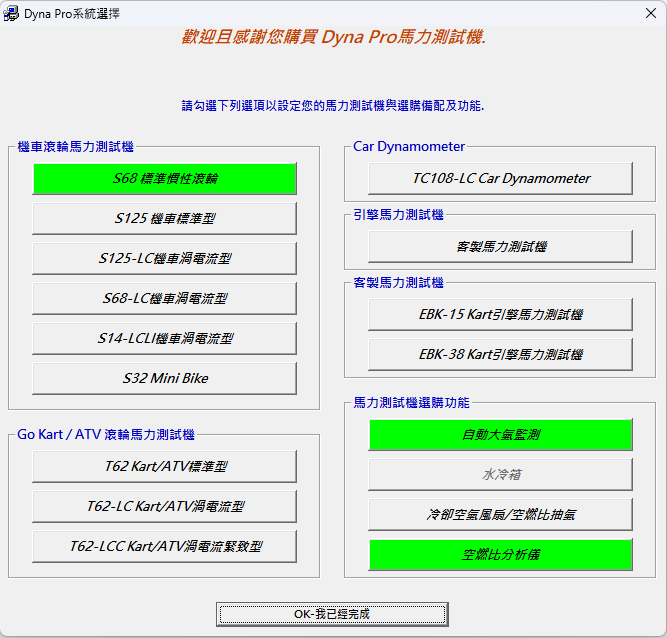
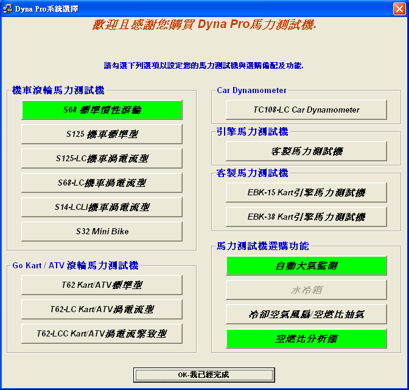
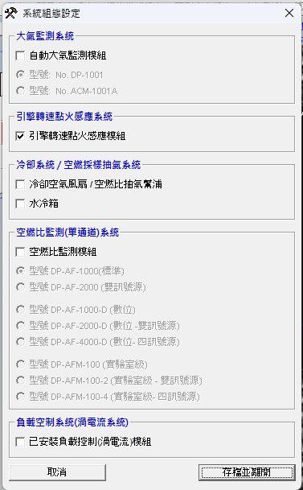
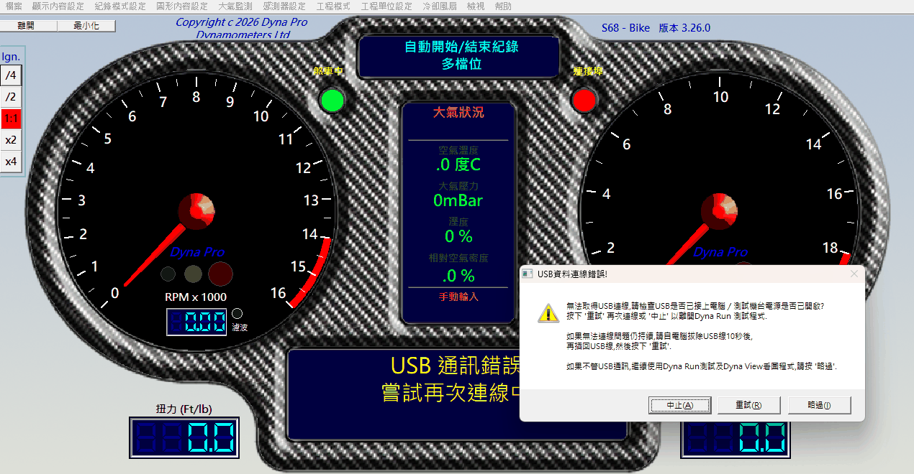
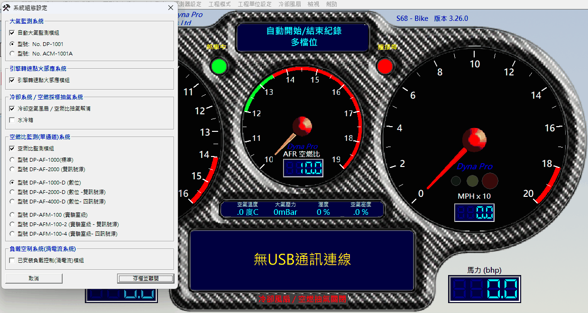
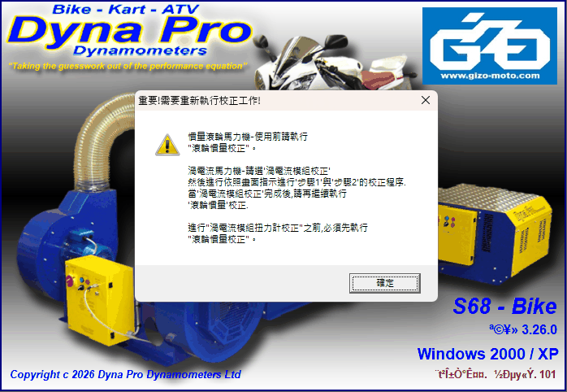
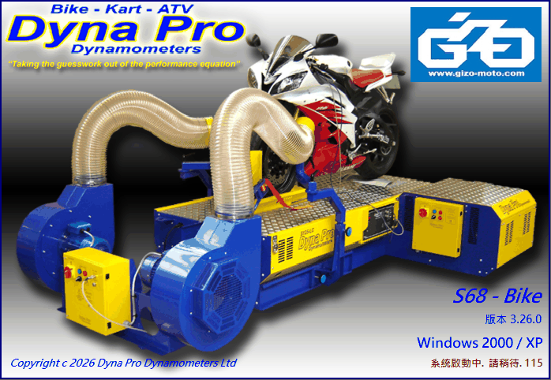
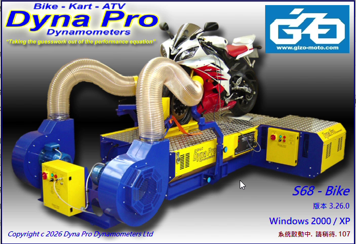
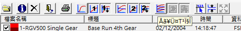

# DynaRun V3 first start: system selection hangs after "OK"

[繁體中文在下方](#繁體中文)

Developer notes on DynaRun V3 3.26.0's first-start sequence, what goes wrong in it and what DynaRunFix does
about it. Findings from 2026-10-07. The user-facing summary is in the [README](../README.md#first-time-setup).

## Symptom

On the first start (no `HKCU\Software\DynaPro` yet) DynaRun shows a language dialog, then the system selection
window "Dyna Pro系統選擇" (model plus optional features). After **OK**:

* Windows shows a UAC prompt for `Setup_<n>.exe`;
* the selection window stays, DynaRun uses one CPU core at 100 %, and it never continues;
* after killing and restarting DynaRun the chosen model is active, but the language is English and the
  optional features are switched off.

## What DynaRun does on "OK"

On OK, DynaRun stores the selection and runs
`%APPDATA%\Dyna Pro Dynamometers\Dyna Run V3\System Data\Setup_<n>.exe` with `ShellExecuteA` — one helper per
model, e.g. `Setup_114.exe` for the S68, `Setup_103.exe` for the S125. Each helper is a tiny VB6 program
("Registry Setup <n>") that writes that model's defaults into `HKCU\Software\DynaPro` with
`WScript.Shell.RegWrite`, then exits.

The helpers have no manifest and "Setup" in their file name and description, so Windows' installer detection
runs them elevated (UAC prompt). That prompt is a side effect, not the cause of the hang (below).

## Ruled out: UAC virtualization

File/registry virtualization would hide the helper's writes from the non-elevated DynaRun only if they went to
virtualized locations. They do not: everything lives in `HKCU\Software\DynaPro` and `%APPDATA%`, which are never
virtualized, and an elevated process of the same administrator account writes the same `HKCU`. Process Monitor
confirms DynaRun reads the helper's values on its next start.

## Root causes

Found by observing DynaRun from the outside: Process Monitor traces and window behaviour on Win11, Win7 and XP VMs.

1. **DynaRun waits forever (its own behaviour).** After starting the helper, DynaRun keeps processing messages
   but never continues, even after the helper has exited: the selection window stays and one core runs at 100 %. Reproduced identically on a **fresh XP VM with the
   official installer** (administrator account, no UAC), on Win7 and on Win11 → not caused by UAC or by
   DynaRunFix. Presumably DynaRun is meant to be restarted after the helper; the new configuration is read
   only on the next start.
2. **The helper resets the language.** It writes `Operation_Data\Default_Language = "English"`, over the
   language DynaRun stored from the language dialog a moment earlier. It also writes `Version`,
   `Instalation_Date` (sic) and the path values as `"0"`; DynaRun fills those in on its next start, so they
   need no fix.
3. **Optional features end up disabled.** The features picked on the selection screen are stored as models
   (`Calibration_Data\Auto_Climate_Model`, `Air_Fuel_Model`), but the matching `System_Setup` enable flags are
   never set — the helper writes them as `0`. The configuration dialog then shows the modules unchecked:

   

   Details (registry captures before/after OK and after *工程模式 → 系統組態設定 → 存檔並離開*, Win11):

   * The group "馬力測試機選購功能" has four buttons: 自動大氣監測 (auto climate), 水冷箱 (water cooler, greyed out,
     cannot be picked), 冷卻空氣風扇/空燃比抽氣 (cooling fans / AFR extraction, no model dialog), 空燃比分析儀
     (AFR analyser). A picked button is drawn green.
   * The model dialogs store indexes: `Calibration_Data\Auto_Climate_Model` DP-1001 = 0, ACM-1001A = 1;
     `Air_Fuel_Model` DP-AF-1000 = 0, DP-AF-2000 = 1, DP-AF-1000-D = 2, DP-AF-2000-D = 3, DP-AF-4000-D = 4,
     DP-AFM-100 = 5, DP-AFM-100-2 = 6, DP-AFM-100-4 = 7.
   * `Setup_<n>.exe` writes `System_Setup\Auto_Climate_Enable`, `Property_Auto_Climate`, `Cooling_Fan_Enable`,
     `Water_Cooler_Enable`, `Int_AF_Ratio_Enable` as `0`. *存檔並離開* writes `REG_SZ "-1"` for each ticked
     module (climate: both `Auto_Climate_Enable` and `Property_Auto_Climate`), whatever model is chosen.
   * The same frame also holds two hidden (clipped) buttons of another group, EB-150 / EB-250 engine
     dynamometers, and the cooling fan button is not a child of the frame — so the buttons have to be found by
     position, skipping hidden ones.

## Fixes in DynaRunFix

All in memory, no DynaRun file is changed.

| Part | Change | Status |
|---|---|---|
| `dynafix.dll` | Wraps DynaRun's `ShellExecuteA` (a VB *Declare*, resolved by MSVBVM60 through `GetProcAddress`). For `Setup_*` it runs the helper with `ShellExecuteExA`, waits for it (one UAC prompt), puts back the `Default_Language` DynaRun had stored before the helper ran, and restarts DynaRun through `DynaRunFix.exe /restart <pid>` — so the endless loop is never entered. | Verified, Win11 zh-TW, DynaRun 3.26.0 |
| `DynaRunFix.exe` (launcher) | Starts DynaRun with `CREATE_SUSPENDED`, resumes it and polls `SetWindowsHookEx(WH_CALLWNDPROC)` on its GUI thread until it succeeds (a thread can be hooked only once it has a message queue; before that the call fails with error 87). Through Locale Emulator it starts `LEProc.exe` suspended in a job object, is told at once when DynaRun's process is created and hooks DynaRun's first thread the same way. `dynafix.dll` is then loaded before the first window, so the splash screen and forms created at start-up are covered too. With `/restart <pid>` it first waits (up to 15 s) for the old DynaRun to end. | Verified, Win11 (log: `hooked from start`) and native zh-TW Win11 |
| `DynaRunFix-Setup.exe` | Elevation from a mapped network drive (e.g. a VM shared folder) first copies the setup to `%TEMP%` and elevates the copy — the elevated process cannot see the user's mapped drives. Before, no UAC prompt appeared and the install failed silently. | Verified, Win11 (UAC names the `%TEMP%` copy) |
| `DynaRunFix-Setup.exe` (wizard) | Comes back to the foreground after the elevated part (the elevated process calls `AllowSetForegroundWindow`; if msiexec's window still holds the foreground, the wizard is raised in z-order and activated through `AttachThreadInput`, else its taskbar button flashes). | Verified, Win11 (final page in front of a maximized Explorer) |
| `dynafix.dll` (optional features) | While the selection screen is still open, reads which optional-feature buttons are green (controls inside the frame by position, hidden EB-150/EB-250 skipped). After the helper it writes the `System_Setup` flags that *存檔並離開* would write (`Auto_Climate_Enable` + `Property_Auto_Climate`, `Cooling_Fan_Enable`, `Int_AF_Ratio_Enable`, `Water_Cooler_Enable`) as `"-1"`, logs each value, then restarts DynaRun. If the buttons cannot be read, climate/AFR count as picked when a model was stored. | Verified, Win11 (cooling fan alone; climate + fan + AFR) and native zh-TW Win11 (v1.2.2 code); XP not tested |

After the restart DynaRun comes up with the chosen model and language:

With the optional-feature fix the configuration dialog shows the picked modules (here DP-1001, cooling fan,
DP-AF-1000-D) and the main window shows the AFR gauge and the climate strip:

Splash screen before and after the launcher hooked DynaRun from start (version and status line), with the
`DYNAFIX_CHARSET` font replacement — a Traditional Chinese locale now uses Locale Emulator instead (below):

### v1.2.2 on a fresh Windows 11

Recorded on a fresh native Traditional Chinese Windows 11 with `DynaRunFix-Setup.exe` 1.2.2 (DynaRun 3.26.0
downloaded and installed by the setup): Chinese picked, S68 with climate monitor and AFR analyser, one UAC prompt for
`Setup_114.Exe`, automatic restart. Splash screen and main window in Microsoft JhengHei UI, status bar above the taskbar.

## Native Traditional Chinese Windows 11 (comparison)

A Win11 installed in Traditional Chinese (ANSI code page 950), fresh DynaRun from the official installer:

* Without DynaRunFix the first start never completes: the helper's UAC prompt is accepted, the selection screen
  keeps coming back and the registry stays at the placeholder values → the hang is not tied to a changed
  system locale.
* With DynaRunFix everything worked (language kept, model, splash/RPM dialog/viewer in Chinese, no garbled text).
* `FontAssoc\Associated CharSet` does not exist at all there (no `ANSI(00)=YES`), and no charset handling is needed (the UI-font swap of v1.2.2 still applies, see the
  README's *Fonts* section).

## Garbled text after the locale was changed to Chinese (final fix: Locale Emulator)

Not a first-start problem, but found in the same tests. On a Windows installed in English whose system locale
was changed to Chinese (Taiwan) later, `FontAssoc\Associated CharSet` lacks `ANSI(00)=YES`, and DynaRun's Big5
text in ANSI-charset fonts is drawn as Latin letters.

* First attempt (branch `claude/fontfix-labels`, **stopped**): `dynafix.dll` switched the fonts created by OCX
  controls and `comctl32` to the Big5 charset. RPM dialog and viewer labels became Chinese, but the toolbar
  tooltips (圖形設定 (手動開啟圖形), viewer) stayed garbled:

  

* **Final fix** (v1.2.2): for a Traditional Chinese locale without `ANSI(00)=YES` the launcher starts
  DynaRun through Locale Emulator, with `dynafix.dll` attached as usual. Verified by Tim on Win11: splash, dialogs,
  viewer and tooltips all Chinese, no flicker. `DYNAFIX_CHARSET` (the charset `dynafix.dll` gives the fonts it
  swaps) remains only for other DBCS locales, or when LE is missing.
* A natively Traditional Chinese Windows needs no charset handling, only the first-start fix; the UI-font swap
  (README, *Fonts*) applies there as everywhere else.

## How this was tested

* VirtualBox VMs: Windows 11 (locale changed to zh-TW), Windows 11 installed in zh-TW, Windows 7, Windows XP
  (fresh install with the official DynaRun installer).
  A Sonnet subagent drove the VMs through `VBoxManage` keyboard/mouse input and screenshots.
* Process Monitor captures filtered to `DynaPro` / `Setup_` events, registry dumps of `HKCU\Software\DynaPro`
  before and after the helper.
* A diagnostic trace build of `dynafix.dll` that patched DynaRun's resolved *Declare* pointers with logging
  thunks, to see the call sequence around OK (the `ShellExecuteA` call, then nothing but `DoEvents`).

---

## 繁體中文

DynaRun V3 3.26.0 首次啟動流程的開發紀錄:哪裡出錯、DynaRunFix 怎麼處理。2026-10-07 的調查結果。
使用者版說明見 [README](../README.md#首次設定)。

### 症狀

首次啟動(還沒有 `HKCU\Software\DynaPro`)時,DynaRun 先顯示語言對話框,再顯示「Dyna Pro系統選擇」(機型與選購功能)。按 **OK** 後:

* 出現 `Setup_<編號>.exe` 的 UAC 提示;
* 選擇視窗不消失、DynaRun 佔滿一個 CPU 核心,永遠不會繼續;
* 強制結束再啟動後機型正確,但語言變回英文,選購功能都是關閉的。

### 按 OK 時 DynaRun 做了什麼

按下 OK 後,DynaRun 存下選擇,用 `ShellExecuteA` 執行
`%APPDATA%\Dyna Pro Dynamometers\Dyna Run V3\System Data\Setup_<編號>.exe`。每個機型一個(S68 是 `Setup_114.exe`、
S125 是 `Setup_103.exe`…),都是很小的 VB6 程式「Registry Setup <編號>」,用 `WScript.Shell.RegWrite` 把該機型的預設值寫進
`HKCU\Software\DynaPro` 後結束。這些程式沒有 manifest、名稱含「Setup」,Windows 的安裝程式偵測會以系統管理員執行(UAC)。
UAC 只是附帶現象,不是卡住的原因。

### 已排除:UAC 虛擬化

所有設定都在 `HKCU\Software\DynaPro` 和 `%APPDATA%`,這兩處不會被虛擬化;同一個管理員帳號提升權限後寫的也是同一個 HKCU。
Process Monitor 也確認 DynaRun 下次啟動會讀到設定程式寫的值。

### 根本原因

依據從外部觀察 DynaRun 的結果(Win11/Win7/XP 虛擬機的 Process Monitor 紀錄與視窗行為):

1. **DynaRun 自己無限等待。** 啟動設定程式後,DynaRun 持續處理訊息卻永遠不會繼續,設定程式結束了也一樣,
   所以視窗不消失、CPU 一核 100%。在**全新 XP 虛擬機 + 官方安裝程式**(管理員帳號、沒有 UAC)、Win7、Win11 上都一模一樣
   → 是 DynaRun 本身的行為,與 UAC 或 DynaRunFix 無關。新設定要到下次啟動才會讀取。
2. **設定程式把語言改回英文。** 它寫入 `Operation_Data\Default_Language = "English"`,蓋掉 DynaRun 剛從語言對話框存下的選擇。
   `Version`、`Instalation_Date`(原文拼法)與路徑值寫成 `"0"`,DynaRun 下次啟動會自己補上,不需處理。
3. **選購功能被關閉。** 選擇畫面勾的功能會存成型號(`Calibration_Data\Auto_Climate_Model`、`Air_Fuel_Model`),
   但對應的 `System_Setup` 啟用旗標從沒被設定(設定程式寫成 `0`),所以系統組態設定裡這些模組都沒勾。
   * 「馬力測試機選購功能」有四個按鈕:自動大氣監測、水冷箱(灰色,不能選)、冷卻空氣風扇/空燃比抽氣(沒有型號對話框)、空燃比分析儀;選到的按鈕是綠色。
   * 型號存成索引:`Auto_Climate_Model` DP-1001 = 0、ACM-1001A = 1;`Air_Fuel_Model` DP-AF-1000 = 0 … DP-AFM-100-4 = 7(依對話框順序)。
   * 設定程式把 `System_Setup` 的 `Auto_Climate_Enable`、`Property_Auto_Climate`、`Cooling_Fan_Enable`、`Water_Cooler_Enable`、`Int_AF_Ratio_Enable` 寫成 `0`;
     「存檔並離開」則對勾選的模組寫 `REG_SZ "-1"`,與型號無關。
   * 同一個框裡還有另一組隱藏(被裁掉)的 EB-150/EB-250 按鈕,冷卻風扇按鈕也不是框的子視窗,所以要依位置找按鈕並略過隱藏的。

### DynaRunFix 的修正

全部在記憶體中處理,不修改 DynaRun 的任何檔案。

| 元件 | 修改 | 狀態 |
|---|---|---|
| `dynafix.dll` | 包裝 `ShellExecuteA`:遇到 `Setup_*` 時用 `ShellExecuteExA` 執行並等待(一次 UAC),寫回 DynaRun 先前存的 `Default_Language`,再以 `DynaRunFix.exe /restart <pid>` 重新啟動 DynaRun,完全避開無限迴圈。 | 已驗證(Win11 繁中、3.26.0) |
| `DynaRunFix.exe` | 以 `CREATE_SUSPENDED` 啟動 DynaRun,恢復執行後輪詢 `SetWindowsHookEx`,直到其 GUI 執行緒有訊息佇列(之前會回傳錯誤 87)。經 Locale Emulator 時則把 `LEProc.exe` 暫停啟動並放進 job 物件,DynaRun 一建立就收到通知,再以同樣方式掛上它的第一個執行緒。這樣 `dynafix.dll` 在第一個視窗之前就載入,啟動畫面和一開始建立的表單也都涵蓋。`/restart <pid>` 時先等舊的 DynaRun 結束(最多 15 秒)。 | 已驗證(Win11、原生繁中 Win11) |
| `DynaRunFix-Setup.exe` | 從網路磁碟機(例如虛擬機共用資料夾)提升權限時,先複製到 `%TEMP%` 再提升(提升後的行程看不到使用者對應的網路磁碟機)。修正前不會出現 UAC,安裝無聲失敗。 | 已驗證(Win11) |
| 安裝精靈 | 提升權限的部分結束後回到前景(`AllowSetForegroundWindow`;若前景仍被 msiexec 視窗佔住,改用 z-order + `AttachThreadInput`,再不行就閃爍工作列按鈕)。 | 已驗證(Win11) |
| `dynafix.dll`(選購功能) | 選擇畫面還開著時讀出哪些選購功能按鈕是綠色(依位置、略過隱藏的 EB-150/EB-250),設定程式結束後寫入「存檔並離開」會寫的 `"-1"` 旗標並記錄,再重新啟動 DynaRun。讀不到按鈕時,有存型號的大氣監測/空燃比視為已選。 | 已驗證(Win11;原生繁中 Win11 以 v1.2.2 的程式碼測試);XP 未測 |

v1.2.2 在全新原生繁中 Win11 上的錄影截圖(由 `DynaRunFix-Setup.exe` 1.2.2 下載並安裝 DynaRun 3.26.0;選中文、S68、勾選大氣監測與空燃比分析儀,
`Setup_114.Exe` 一次 UAC,自動重新啟動;啟動畫面與主畫面都是 Microsoft JhengHei UI,狀態列在工作列上方):

### 原生繁中 Win11 對照

以繁體中文安裝的 Win11(字碼頁 950)、官方安裝程式全新安裝 DynaRun:沒有 DynaRunFix 時首次啟動過不去(接受 UAC 後選擇畫面一直回來,登錄停在預設佔位值),
所以卡住與「後來才改系統地區」無關;有 DynaRunFix 時全部正常、沒有亂碼。該系統根本沒有 `FontAssoc\Associated CharSet`(沒有 `ANSI(00)=YES`),也不需要任何字元集處理(v1.2.2 的介面字型替換仍會套用,見 README「字型」)。

### 地區後來才改成中文時的亂碼(最終解法:Locale Emulator)

不是首次啟動的問題,但在同一批測試中發現。英文安裝、之後才把系統地區改成中文(台灣)的 Windows,`FontAssoc\Associated CharSet` 缺 `ANSI(00)=YES`,
DynaRun 在 ANSI 字元集字型裡的 Big5 文字會變成拉丁字母。

* 第一個做法(分支 `claude/fontfix-labels`,**已停止**):`dynafix.dll` 把 OCX 與 `comctl32` 建立的字型改成 Big5 字元集。
  轉速錶設定與看圖程式的標籤變成中文,但工具列 tooltip(圖形設定(手動開啟圖形)、看圖程式)仍是亂碼。
* **最終解法**(v1.2.2):繁中地區且缺 `ANSI(00)=YES` 時,啟動器改用 Locale Emulator 啟動 DynaRun(照常掛上 `dynafix.dll`)。
  Tim 已在 Win11 驗證:啟動畫面、對話框、看圖程式、tooltip 全部是中文,不閃爍。`DYNAFIX_CHARSET`(`dynafix.dll` 替換字型時使用的字元集)只留給其他 DBCS 地區或找不到 LE 時。
* 原生繁中 Windows 不需要字元集處理,只需要首次啟動的修正;介面字型替換(README「字型」)在這裡也一樣套用。

### 測試方法

VirtualBox 虛擬機(Win11 改繁中地區、原生繁中 Win11、Win7、全新 XP),由 Sonnet 子代理透過 `VBoxManage` 鍵盤/滑鼠操作與截圖;
Process Monitor 只篩選 `DynaPro`/`Setup_` 事件;設定程式執行前後匯出 `HKCU\Software\DynaPro`;
另做一個診斷用的 `dynafix.dll`,把 DynaRun 已解析的 *Declare* 指標換成記錄用的 thunk,看出按 OK 後只剩 `ShellExecuteA` 和不停的 `DoEvents`。
